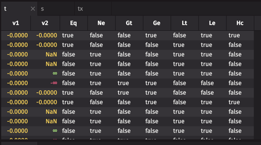
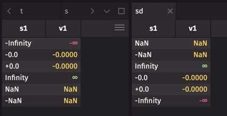

# test-numerical-comparisons

A look at numerical comparisons in different languages so that they can be compared against IEEE754.
In specific, this repo is looking at equality, ordering, and hashing of unusual floating point numbers
in different languages used for numerical computing.

## IEEE754

Details of IEEE754 can be found on [Wikipedia](https://en.wikipedia.org/wiki/IEEE_754).

1. [NaN comparisons are unordered](https://en.wikipedia.org/wiki/IEEE_754#Comparison_predicates)
2. [`-0.0` and `0.0` are equal](https://en.wikipedia.org/wiki/IEEE_754#Comparison_predicates)
3. [`-0.0` is less than `0.0`](https://en.wikipedia.org/wiki/IEEE_754#Total-ordering_predicate)
4. [`-NaN < -Inf` and `+Inf < +NaN`](https://en.wikipedia.org/wiki/IEEE_754#Total-ordering_predicate)
5. [`min(+0.0, -0.0) = min(-0.0, +0.0) = -0.0 or 0.0`](https://en.wikipedia.org/wiki/IEEE_754-2008_revision#Min_and_max)
6. [`max(+0.0, -0.0) = max(-0.0, +0.0) = +0.0 or 0.0`](https://en.wikipedia.org/wiki/IEEE_754-2008_revision#Min_and_max)
7. [The result of `min(x, NaN)` or `max(x, NaN)` may vary depending on the IEEE754 revision.](https://en.wikipedia.org/wiki/IEEE_754-2008_revision#Min_and_max)
8. [There are quiet and signaling NaNs.  For our langagues, quiet NaNs are used.](https://en.wikipedia.org/wiki/IEEE_754#NaNs)

### Why are NaN values not equal in IEEE754?

> **NOTE:** AI summary.

NaN (Not a Number) values are not equal to themselves or any other value in IEEE 754 floating-point arithmetic for 
several important reasons:

1. Representation of undefined operations: NaN is used to represent the result of undefined mathematical operations like 0/0 or sqrt(-1). Since these operations don't have a well-defined numerical result, it wouldn't make sense for NaNs resulting from different undefined operations to be considered equal.
2. Propagation of errors: The inequality of NaN to itself allows errors to propagate through calculations. If a NaN is produced at any step, comparing it to other values (including itself) will always return false, helping to identify and track error conditions.
3. Multiple NaN representations: There are actually many different bit patterns that can represent NaN in IEEE 754. While they all indicate an invalid or undefined result, they can carry different information about the specific operation that produced them.
4. Consistency with other comparisons: Since NaN is considered unordered with respect to all other floating-point values (including itself), having NaN == NaN be false maintains consistency with other comparison operations involving NaN.
5. Special handling in algorithms: The behavior of NaN in comparisons allows for special handling in sorting and other algorithms. For example, it ensures that NaNs are treated as distinct values for sorting, uniquing, and hashing purposes.

## Java

> :warning: **WARNING:** Java does not support IEE754 `-NaN`.  All NaNs are treated as positive.

| lang | v1 | v2 | == | != | > | >= | < | <= | hashCode== | 
| --- | --- | --- | --- | --- | --- | --- | --- | --- | --- |
| Java | -0.00 | -0.00 | True | False | False | True | False | True | True | 
| Java | -0.00 | 0.00 | True | False | False | True | False | True | False | 
| Java | -0.00 | NaN | False | True | False | False | False | False | False | 
| Java | -0.00 | NaN | False | True | False | False | False | False | False | 
| Java | -0.00 | Infinity | False | True | False | False | True | True | False | 
| Java | -0.00 | -Infinity | False | True | True | True | False | False | False | 
| Java | 0.00 | -0.00 | True | False | False | True | False | True | False | 
| Java | 0.00 | 0.00 | True | False | False | True | False | True | True | 
| Java | 0.00 | NaN | False | True | False | False | False | False | False | 
| Java | 0.00 | NaN | False | True | False | False | False | False | False | 
| Java | 0.00 | Infinity | False | True | False | False | True | True | False | 
| Java | 0.00 | -Infinity | False | True | True | True | False | False | False | 
| Java | NaN | -0.00 | False | True | False | False | False | False | False | 
| Java | NaN | 0.00 | False | True | False | False | False | False | False | 
| Java | NaN | NaN | False | True | False | False | False | False | True | 
| Java | NaN | NaN | False | True | False | False | False | False | True | 
| Java | NaN | Infinity | False | True | False | False | False | False | False | 
| Java | NaN | -Infinity | False | True | False | False | False | False | False | 
| Java | NaN | -0.00 | False | True | False | False | False | False | False | 
| Java | NaN | 0.00 | False | True | False | False | False | False | False | 
| Java | NaN | NaN | False | True | False | False | False | False | True | 
| Java | NaN | NaN | False | True | False | False | False | False | True | 
| Java | NaN | Infinity | False | True | False | False | False | False | False | 
| Java | NaN | -Infinity | False | True | False | False | False | False | False | 
| Java | Infinity | -0.00 | False | True | True | True | False | False | False | 
| Java | Infinity | 0.00 | False | True | True | True | False | False | False | 
| Java | Infinity | NaN | False | True | False | False | False | False | False | 
| Java | Infinity | NaN | False | True | False | False | False | False | False | 
| Java | Infinity | Infinity | True | False | False | True | False | True | True | 
| Java | Infinity | -Infinity | False | True | True | True | False | False | False | 
| Java | -Infinity | -0.00 | False | True | False | False | True | True | False | 
| Java | -Infinity | 0.00 | False | True | False | False | True | True | False | 
| Java | -Infinity | NaN | False | True | False | False | False | False | False | 
| Java | -Infinity | NaN | False | True | False | False | False | False | False | 
| Java | -Infinity | Infinity | False | True | False | False | True | True | False | 
| Java | -Infinity | -Infinity | True | False | False | True | False | True | True | 

## Python

| lang   | v1 | v2 | == | != | > | >= | < | <= | hashCode== |
|--- | --- | --- | --- | --- | --- | --- | --- | --- | --- |
| Python | -0.0 | -0.0 | True | False | False | True | False | True | True |
| Python | -0.0 | 0.0 | True | False | False | True | False | True | False |
| Python | -0.0 | math.nan | False | True | False | False | False | False | False |
| Python | -0.0 | -math.nan | False | True | False | False | False | False | False |
| Python | -0.0 | math.inf | False | True | False | False | True | True | False |
| Python | -0.0 | -math.inf | False | True | True | True | False | False | False |
| Python | 0.0 | -0.0 | True | False | False | True | False | True | False |
| Python | 0.0 | 0.0 | True | False | False | True | False | True | True |
| Python | 0.0 | math.nan | False | True | False | False | False | False | False |
| Python | 0.0 | -math.nan | False | True | False | False | False | False | False |
| Python | 0.0 | math.inf | False | True | False | False | True | True | False |
| Python | 0.0 | -math.inf | False | True | True | True | False | False | False |
| Python | math.nan | -0.0 | False | True | False | False | False | False | False |
| Python | math.nan | 0.0 | False | True | False | False | False | False | False |
| Python | math.nan | math.nan | False | True | False | False | False | False | True |
| Python | math.nan | -math.nan | False | True | False | False | False | False | False |
| Python | math.nan | math.inf | False | True | False | False | False | False | False |
| Python | math.nan | -math.inf | False | True | False | False | False | False | False |
| Python | -math.nan | -0.0 | False | True | False | False | False | False | False |
| Python | -math.nan | 0.0 | False | True | False | False | False | False | False |
| Python | -math.nan | math.nan | False | True | False | False | False | False | False |
| Python | -math.nan | -math.nan | False | True | False | False | False | False | True |
| Python | -math.nan | math.inf | False | True | False | False | False | False | False |
| Python | -math.nan | -math.inf | False | True | False | False | False | False | False |
| Python | math.inf | -0.0 | False | True | True | True | False | False | False |
| Python | math.inf | 0.0 | False | True | True | True | False | False | False |
| Python | math.inf | math.nan | False | True | False | False | False | False | False |
| Python | math.inf | -math.nan | False | True | False | False | False | False | False |
| Python | math.inf | math.inf | True | False | False | True | False | True | True |
| Python | math.inf | -math.inf | False | True | True | True | False | False | False |
| Python | -math.inf | -0.0 | False | True | False | False | True | True | False |
| Python | -math.inf | 0.0 | False | True | False | False | True | True | False |
| Python | -math.inf | math.nan | False | True | False | False | False | False | False |
| Python | -math.inf | -math.nan | False | True | False | False | False | False | False |
| Python | -math.inf | math.inf | False | True | False | False | True | True | False |
| Python | -math.inf | -math.inf | True | False | False | True | False | True | True |

## R

> **NOTE:** `digest::digest` was used to calculate the hash code for R.

> :warning: **WARNING:** When NaN is involved in an R comparison, the result is `NA`, the R equivalent of `null`.

| lang | v1 | v2 | == | != | > | >= | < | <= | hashCode== | 
| --- | --- | --- | --- | --- | --- | --- | --- | --- | --- | 
| R | -0.0 | -0.0 | TRUE | FALSE | FALSE | TRUE | FALSE | TRUE | TRUE | 
| R | -0.0 | 0.0 | TRUE | FALSE | FALSE | TRUE | FALSE | TRUE | FALSE | 
| R | -0.0 | NaN | NA | NA | NA | NA | NA | NA | FALSE | 
| R | -0.0 | -NaN | NA | NA | NA | NA | NA | NA | FALSE | 
| R | -0.0 | Inf | FALSE | TRUE | FALSE | FALSE | TRUE | TRUE | FALSE | 
| R | -0.0 | -Inf | FALSE | TRUE | TRUE | TRUE | FALSE | FALSE | FALSE | 
| R | 0.0 | -0.0 | TRUE | FALSE | FALSE | TRUE | FALSE | TRUE | FALSE | 
| R | 0.0 | 0.0 | TRUE | FALSE | FALSE | TRUE | FALSE | TRUE | TRUE | 
| R | 0.0 | NaN | NA | NA | NA | NA | NA | NA | FALSE | 
| R | 0.0 | -NaN | NA | NA | NA | NA | NA | NA | FALSE | 
| R | 0.0 | Inf | FALSE | TRUE | FALSE | FALSE | TRUE | TRUE | FALSE | 
| R | 0.0 | -Inf | FALSE | TRUE | TRUE | TRUE | FALSE | FALSE | FALSE | 
| R | NaN | -0.0 | NA | NA | NA | NA | NA | NA | FALSE | 
| R | NaN | 0.0 | NA | NA | NA | NA | NA | NA | FALSE | 
| R | NaN | NaN | NA | NA | NA | NA | NA | NA | TRUE | 
| R | NaN | -NaN | NA | NA | NA | NA | NA | NA | FALSE | 
| R | NaN | Inf | NA | NA | NA | NA | NA | NA | FALSE | 
| R | NaN | -Inf | NA | NA | NA | NA | NA | NA | FALSE | 
| R | -NaN | -0.0 | NA | NA | NA | NA | NA | NA | FALSE | 
| R | -NaN | 0.0 | NA | NA | NA | NA | NA | NA | FALSE | 
| R | -NaN | NaN | NA | NA | NA | NA | NA | NA | FALSE | 
| R | -NaN | -NaN | NA | NA | NA | NA | NA | NA | TRUE | 
| R | -NaN | Inf | NA | NA | NA | NA | NA | NA | FALSE | 
| R | -NaN | -Inf | NA | NA | NA | NA | NA | NA | FALSE | 
| R | Inf | -0.0 | FALSE | TRUE | TRUE | TRUE | FALSE | FALSE | FALSE | 
| R | Inf | 0.0 | FALSE | TRUE | TRUE | TRUE | FALSE | FALSE | FALSE | 
| R | Inf | NaN | NA | NA | NA | NA | NA | NA | FALSE | 
| R | Inf | -NaN | NA | NA | NA | NA | NA | NA | FALSE | 
| R | Inf | Inf | TRUE | FALSE | FALSE | TRUE | FALSE | TRUE | TRUE | 
| R | Inf | -Inf | FALSE | TRUE | TRUE | TRUE | FALSE | FALSE | FALSE | 
| R | -Inf | -0.0 | FALSE | TRUE | FALSE | FALSE | TRUE | TRUE | FALSE | 
| R | -Inf | 0.0 | FALSE | TRUE | FALSE | FALSE | TRUE | TRUE | FALSE | 
| R | -Inf | NaN | NA | NA | NA | NA | NA | NA | FALSE | 
| R | -Inf | -NaN | NA | NA | NA | NA | NA | NA | FALSE | 
| R | -Inf | Inf | FALSE | TRUE | FALSE | FALSE | TRUE | TRUE | FALSE | 
| R | -Inf | -Inf | TRUE | FALSE | FALSE | TRUE | FALSE | TRUE | TRUE | 

## Julia

> **NOTE:** Julia has `==`, `===`, and `isequal` to compare floating point numbers.
> `==` is used for mathematical value equality, `===` is used for object identity, 
> while `isequal` is used for bitwise equality.

| Julia | v1 | v2 | == | != | > | >= | < | <= | hash== | isequal | === |
| --- | --- | --- | --- | --- | --- | --- | --- | --- | --- |
| Julia | -0.0 | -0.0 | true | false | false | true | false | true | true | true | true |
| Julia | -0.0 | 0.0 | true | false | false | true | false | true | false | false | false |
| Julia | -0.0 | NaN | false | true | false | false | false | false | false | false | false |
| Julia | -0.0 | -NaN | false | true | false | false | false | false | false | false | false |
| Julia | -0.0 | Inf | false | true | false | false | true | true | false | false | false |
| Julia | -0.0 | -Inf | false | true | true | true | false | false | false | false | false |
| Julia | 0.0 | -0.0 | true | false | false | true | false | true | false | false | false |
| Julia | 0.0 | 0.0 | true | false | false | true | false | true | true | true | true |
| Julia | 0.0 | NaN | false | true | false | false | false | false | false | false | false |
| Julia | 0.0 | -NaN | false | true | false | false | false | false | false | false | false |
| Julia | 0.0 | Inf | false | true | false | false | true | true | false | false | false |
| Julia | 0.0 | -Inf | false | true | true | true | false | false | false | false | false |
| Julia | NaN | -0.0 | false | true | false | false | false | false | false | false | false |
| Julia | NaN | 0.0 | false | true | false | false | false | false | false | false | false |
| Julia | NaN | NaN | false | true | false | false | false | false | true | true | true |
| Julia | NaN | -NaN | false | true | false | false | false | false | false | false | false |
| Julia | NaN | Inf | false | true | false | false | false | false | false | false | false |
| Julia | NaN | -Inf | false | true | false | false | false | false | false | false | false |
| Julia | -NaN | -0.0 | false | true | false | false | false | false | false | false | false |
| Julia | -NaN | 0.0 | false | true | false | false | false | false | false | false | false |
| Julia | -NaN | NaN | false | true | false | false | false | false | false | false | false |
| Julia | -NaN | -NaN | false | true | false | false | false | false | true | true | true |
| Julia | -NaN | Inf | false | true | false | false | false | false | false | false | false |
| Julia | -NaN | -Inf | false | true | false | false | false | false | false | false | false |
| Julia | Inf | -0.0 | false | true | true | true | false | false | false | false | false |
| Julia | Inf | 0.0 | false | true | true | true | false | false | false | false | false |
| Julia | Inf | NaN | false | true | false | false | false | false | false | false | false |
| Julia | Inf | -NaN | false | true | false | false | false | false | false | false | false |
| Julia | Inf | Inf | true | false | false | true | false | true | true | true | true |
| Julia | Inf | -Inf | false | true | true | true | false | false | false | false | false |
| Julia | -Inf | -0.0 | false | true | false | false | true | true | false | false | false |
| Julia | -Inf | 0.0 | false | true | false | false | true | true | false | false | false |
| Julia | -Inf | NaN | false | true | false | false | false | false | false | false | false |
| Julia | -Inf | -NaN | false | true | false | false | false | false | false | false | false |
| Julia | -Inf | Inf | false | true | false | false | true | true | false | false | false |
| Julia | -Inf | -Inf | true | false | false | true | false | true | true | true | true |

## Deephaven

> **NOTE:** Version 0.34.3 was used for Deephaven.

> :warning: **WARNING:** The Deephaven UI seems to be strange with how it displays zeros.  Both plus and 
> minus zero are represented as `-0.0`.  Note the comparison results in this screenshot.
> 

> **NOTE:** Deephaven sort order appears to treat `-0.0` and `0.0` as equal.
> 

|   v1 |   v2 | Eq    | Ne    | Gt    | Ge    | Lt    | Le    | Hc    |
|-----:|-----:|:------|:------|:------|:------|:------|:------|:------|
|   -0 |   -0 | True  | False | False | True  | False | True  | True  |
|   -0 |    0 | True  | False | False | False | True  | True  | False |
|   -0 |  nan | False | True  | False | False | True  | True  | False |
|   -0 |  nan | False | True  | False | False | True  | True  | False |
|   -0 |  inf | False | True  | False | False | True  | True  | False |
|   -0 | -inf | False | True  | True  | True  | False | False | False |
|    0 |   -0 | True  | False | True  | True  | False | False | False |
|    0 |    0 | True  | False | False | True  | False | True  | True  |
|    0 |  nan | False | True  | False | False | True  | True  | False |
|    0 |  nan | False | True  | False | False | True  | True  | False |
|    0 |  inf | False | True  | False | False | True  | True  | False |
|    0 | -inf | False | True  | True  | True  | False | False | False |
|  nan |   -0 | False | True  | True  | True  | False | False | False |
|  nan |    0 | False | True  | True  | True  | False | False | False |
|  nan |  nan | False | True  | False | True  | False | True  | True  |
|  nan |  nan | False | True  | False | True  | False | True  | True  |
|  nan |  inf | False | True  | True  | True  | False | False | False |
|  nan | -inf | False | True  | True  | True  | False | False | False |
|  nan |   -0 | False | True  | True  | True  | False | False | False |
|  nan |    0 | False | True  | True  | True  | False | False | False |
|  nan |  nan | False | True  | False | True  | False | True  | True  |
|  nan |  nan | False | True  | False | True  | False | True  | True  |
|  nan |  inf | False | True  | True  | True  | False | False | False |
|  nan | -inf | False | True  | True  | True  | False | False | False |
|  inf |   -0 | False | True  | True  | True  | False | False | False |
|  inf |    0 | False | True  | True  | True  | False | False | False |
|  inf |  nan | False | True  | False | False | True  | True  | False |
|  inf |  nan | False | True  | False | False | True  | True  | False |
|  inf |  inf | True  | False | False | True  | False | True  | True  |
|  inf | -inf | False | True  | True  | True  | False | False | False |
| -inf |   -0 | False | True  | False | False | True  | True  | False |
| -inf |    0 | False | True  | False | False | True  | True  | False |
| -inf |  nan | False | True  | False | False | True  | True  | False |
| -inf |  nan | False | True  | False | False | True  | True  | False |
| -inf |  inf | False | True  | False | False | True  | True  | False |
| -inf | -inf | True  | False | False | True  | False | True  | True  |

## KDB

> **NOTE:** KDB was not tested.  Information was obtained via AI search.

> :warning: **WARNING:** KDB does not support IEE754 `-NaN`.  All NaNs are treated as positive.

1. NaN values are equal to each other.
2. Nulls and NaNs are equal.
3. Any non-null value is considered greater than a null or NaN.